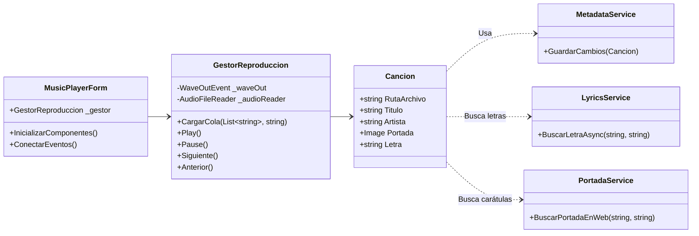
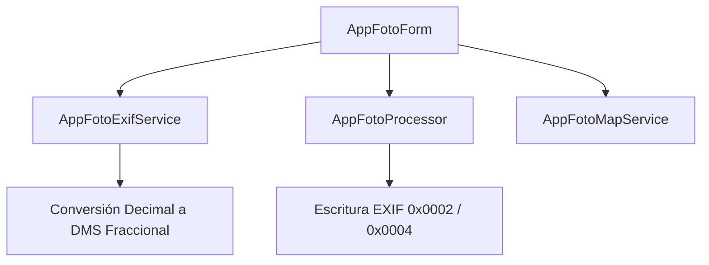
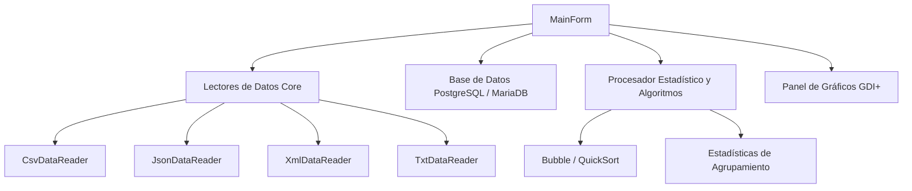
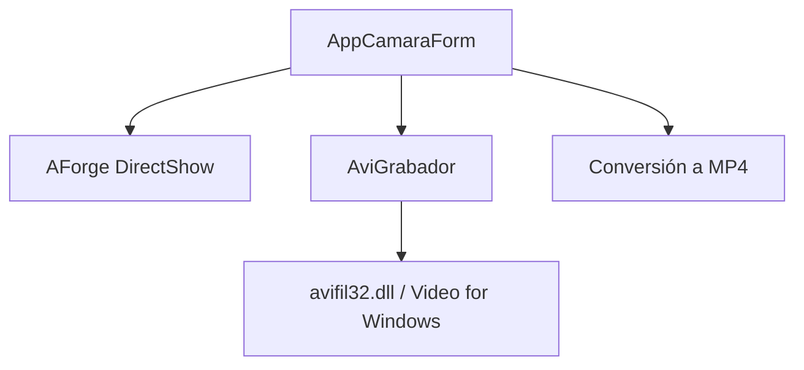

# 📘 Documentación Arquitectónica Exhaustiva: Explorador de Archivos (Estilo Clásico / Soft Pastel)

Este documento detalla a profundidad la arquitectura técnica completa del sistema de Explorador de Archivos, incluyendo su diseño estético clásico *Estilo 95*, el motor modular de sub-aplicaciones y la suite de ciencia de datos *AppData Fusion*.

---

## 🛠️ 1. Infraestructura Tecnológica y Estructuras de Datos Globales

El sistema está desarrollado sobre la plataforma **.NET 8.0 Windows Forms** nativo, utilizando procesamiento asíncrono avanzado y renderizado manual mediante **GDI+** (`System.Drawing`).

### 📦 Paquetes y Dependencias de Terceros
*   **`NAudio` (v2.2.1):** Control directo de hardware de sonido, búferes de audio en memoria y decodificación multihilo de archivos MP3/WAV.
*   **`TagLibSharp` (v2.3.0):** Manipulador de metadatos binarios en las cabeceras de archivos multimedia (ID3v2).
*   **`LibVLCSharp` & `LibVLCSharp.WinForms` (v3.9.3):** Wrapper de alto rendimiento para embeber el motor VLC con aceleración por hardware en la reproducción de video.
*   **`Npgsql` (v9.0.2) & `MySqlConnector` (v2.3.7):** Proveedores de base de datos relacionales ADO.NET para interacciones asíncronas de lectura y escritura masiva.
*   **`Microsoft.Web.WebView2` (v1.0.3912.50):** Control de navegador Chromium embebido que permite inyectar y comunicar mapas interactivos HTML.
*   **`AForge.Video` & `AForge.Video.DirectShow`:** Captura de video en tiempo real desde hardware de cámaras conectadas mediante DirectShow.

### 📊 Estructuras de Datos Empleadas
*   **`List<T>` (Listas Genéricas):** Almacenamiento lineal y dinámico para colecciones de datos, facilitando consultas ultra rápidas mediante **LINQ**.
*   **`Stack<T>` (Pilas LIFO):** Utilizadas para almacenar el historial de navegación (atrás/adelante) y el control de transacciones para la función de deshacer (Undo) en la edición fotográfica.
*   **`Dictionary<TKey, TValue>` (Tablas Hash):** Mapeo de columnas dinámicas, indexación rápida de IDs ($O(1)$) y almacenamiento en caché de iconos o paletas del motor visual.
*   **`HashSet<T>` (Conjuntos de Elementos Únicos):** Detección ultra rápida de duplicados y control de columnas mapeadas en los lectores.

---

## 📂 2. Núcleo del Explorador (`Form1/` y `Models/`)

### 📄 [FileSystemItem.cs](file:///c:/Users/jimes/source/repos/ExploradorArchivos/Models/FileSystemItem.cs)
Representa la abstracción de un archivo o carpeta física en el disco.
*   **Propiedades:**
    *   `Nombre` (string): Nombre local del elemento.
    *   `RutaCompleta` (string): Ruta física absoluta en el disco.
    *   `EsCarpeta` (bool): Flag que determina si el elemento es un nodo de directorio.
    *   `Tipo` (string): Clasificación amigable del archivo (ej. "Documento de texto").
    *   `TamanoTexto` (string): String con el peso pre-formateado (ej: "1.2 MB").
    *   `InfoAdicional` (string): Campo flexible para metadatos complementarios en pantalla.
    *   `FechaModificacion` (DateTime): Fecha y hora del último cambio registrado.
    *   `CategoriaVisual` (string - calculada): Usa `Path.GetExtension` en minúsculas y devuelve `"Audio"`, `"Imágenes"`, `"Video"`, `"Carpetas"` u `"Otros"`.

---

### 📄 [Form1.cs](file:///c:/Users/jimes/source/repos/ExploradorArchivos/Form1/Form1.cs)
Contiene la inicialización del formulario raíz, declaración de variables globales y las opciones principales de manipulación de archivos.
*   **Variables de Estado:**
    *   `_rutaActual` (string): Almacena la ubicación actual en el explorador.
    *   `_historial` (`Stack<string>`): Pila de navegación LIFO para retroceder rutas.
    *   `_itemsActuales` (`List<FileSystemItem>`): Caché local de elementos del directorio actual.
    *   `_filtroActivo` (string): Filtro visual activo (por defecto `"Todos"`).
    *   `_sorter` (`ListViewSorter`): Instancia encargada de la ordenación de columnas.
*   **Métodos Clave:**
    *   `Form1()` (Constructor): Configura los controles principales, activa el pintado manual (`OwnerDraw`) en `ListView` y `TreeView`, asocia eventos y redirige a la pantalla `"Inicio"`.
    *   `ConfigurarContextoMenu()`: Crea el menú contextual interactivo de opciones clásicas, el cual también expone la conversión rápida de archivos (a DOCX, XLSX, PPTX, PDF) utilizando el `FileConverterService` y la fijación de accesos directos (📌 Fijar a acceso directo).
    *   `GetSelectedPath()` (string): Retorna la ruta física del elemento seleccionado.
    *   `AbrirCon(Form)`: Muestra sub-formularios del explorador en pantalla.
    *   `AbrirConSistema(string)`: Delega la ejecución del archivo al visor por defecto de Windows mediante `Process.Start`.
    *   `CortarArchivo(string)`, `CopiarArchivo(string)`: Guardan referencias lógicas para operaciones de pegado.
    *   `EliminarArchivo(string)`: Invoca a `FileService.EnviarAPapelera(ruta)` y recarga la grilla.
    *   `RenombrarArchivo(string, string)`: Maneja el renombrado físico de archivos en disco.
    *   `MostrarPropiedades(string)`: Lanza un diálogo informativo con el peso exacto, fecha de creación y atributos del archivo.
    *   `ConfigurarUI()`, `CrearGrupoHerramientas()`, `ConfigurarSemaforos()`, `ConfigurarBotonClasico()`, `ConectarEventos()`: Métodos de configuración inicial para aplicar la apariencia clásica con colores pastel, bordes biselados y botones redondeados.
*   **Clases Anidadas:**
    *   `CustomMenuRenderer` (`ToolStripProfessionalRenderer`): Personaliza con GDI+ el pintado de menús contextuales para integrarlos a la estética pastel.

---

### 📄 [Form1.Navegacion.cs](file:///c:/Users/jimes/source/repos/ExploradorArchivos/Form1/Form1.Navegacion.cs)
Clase parcial especializada en la carga de directorios, vistas virtuales del equipo y Breadcrumbs.
*   **Métodos Clave:**
    *   `async void CargarDirectorio(string ruta, bool guardarHistorial)`: Obtiene de forma asíncrona los elementos físicos del disco (`FileService.ObtenerContenidoAsync`), actualiza la variable `_itemsActuales` y refresca el `ListView` y las barras de direcciones.
    *   `GenerarVistaInicio()`: Crea un Dashboard dinámico con accesos rápidos a carpetas del usuario e indiza los 15 archivos modificados más recientemente en el disco usando LINQ: `.OrderByDescending(f => f.FechaModificacion).Take(15)`.
    *   `GenerarVistaEsteEquipo()`: Usa `DriveInfo.GetDrives()` para listar y pintar discos duros e información de almacenamiento en barras de progreso.
    *   `PoblarTreeViewNormal()`: Rellena perezosamente el panel lateral de carpetas principales.
    *   `ActualizarBreadcrumbs()`: Parsea la ruta física actual en segmentos para generar botones interactivos individuales que permiten saltos rápidos de directorio.
    *   `MostrarTextBoxDireccion()`, `OcultarTextBoxDireccion()`: Controlan la transición entre la barra interactiva de Breadcrumbs y la barra de búsqueda de direcciones clásica.

---

### 📄 [Form1.Interaccion.cs](file:///c:/Users/jimes/source/repos/ExploradorArchivos/Form1/Form1.Interaccion.cs)
Gestiona las entradas del usuario (teclado, ratón y drag-and-drop).
*   **Métodos Clave:**
    *   `ListViewPrincipal_DoubleClick(object, EventArgs)`: El "Router de Módulos". Identifica si el ítem pulsado es una carpeta para abrirla de inmediato. En caso de ser un archivo, inspecciona su extensión de la siguiente manera:
        *   `.mp3`, `.wav` $\to$ Instancia y ejecuta `MusicPlayerForm` cargando toda la lista de reproducción de la carpeta actual.
        *   `.jpg`, `.png`, `.jpeg`, `.webp` $\to$ Lanza el editor avanzado `AppFotoForm`.
        *   `.mp4`, `.mkv` $\to$ Lanza el procesador multimedia de VLC `AppVideoForm`.
        *   Otros $\to$ Abre el lector genérico `FileViewerForm`.
    *   `ListViewPrincipal_DragDrop()`, `TreeViewLateral_DragDrop()`, `PnlTrash_DragDrop()`: Gestión de interacciones de arrastrar y soltar (Drag & Drop) para mover archivos entre carpetas y para eliminar archivos directamente arrastrándolos hacia la Papelera de Reciclaje.
    *   `ListViewPrincipal_KeyDown(object, KeyEventArgs)`: Mapea atajos de teclado críticos. Borra elementos al pulsar `Delete` y lanza la visualización nativa e inmediata de archivos mediante `QuickLookForm` pulsando la barra espaciadora.

---

### 📄 [Form1.Visualizacion.cs](file:///c:/Users/jimes/source/repos/ExploradorArchivos/Form1/Form1.Visualizacion.cs)
Administra la renderización de ítems en el `ListView`, pestañas de filtros rápidos y miniaturas asíncronas.
*   **Métodos Clave:**
    *   `PoblarListViewDesdeMemoria()`: Carga los ítems en el `ListView` aplicando filtros mediante LINQ.
    *   `ConfigurarFiltrosRapidos()`: Genera pestañas interactivas en la barra superior (Todos, Carpetas, Imágenes, Audio, Video, Otros) para segmentación rápida.
    *   `GenerarMiniaturasAsync()`: Hilo secundario para leer fotos del disco asíncronamente, escalarlas en miniatura y agregarlas a un control `ImageList` para evitar congelamiento de la UI al hacer scroll.
    *   `ListViewPrincipal_ColumnClick(object, ColumnClickEventArgs)`: Procesa clics en columnas para invocar al comparador avanzado `ListViewSorter`.
    *   `ActualizarEstadisticas()`: Calcula agregados estadísticos del directorio (número de archivos, espacio total y extensiones comunes) para mostrarlos en la barra inferior.

---

## 📂 3. Capa de Servicios del Sistema (`Services/`)

### 📄 [FileService.cs](file:///c:/Users/jimes/source/repos/ExploradorArchivos/Services/FileService.cs)
Encapsula operaciones físicas del sistema de archivos y llamadas directas al kernel de Windows.
*   **P/Invoke Nativos:**
    *   `struct SHFILEOPSTRUCT`: Estructura serializada requerida por `shell32.dll`.
    *   `SHFileOperation(ref SHFILEOPSTRUCT FileOp)`: Método de la API nativa de Windows.
*   **Métodos Clave:**
    *   `static bool EnviarAPapelera(string ruta)`: Envía archivos de forma segura a la Papelera de Reciclaje. Añade doble terminación nula a la ruta, usa la bandera `FOF_ALLOWUNDO` ($0x0040$) para permitir deshacer y la bandera `FOF_NOCONFIRMATION` ($0x0010$) para omitir confirmaciones del sistema operativo.
    *   `static async Task<List<FileSystemItem>> ObtenerContenidoAsync(string rutaPath)`: Mapea asíncronamente archivos y carpetas de un directorio físico a objetos `FileSystemItem`.
    *   `private static string FormatearTamano(long bytes)`: Convierte bytes crudos a formatos legibles (KB, MB, GB).

---

### 📄 [CsvIndexer.cs](file:///c:/Users/jimes/source/repos/ExploradorArchivos/Services/CsvIndexer.cs)
Motor asíncrono recursivo para exportar árboles completos de directorios.
*   **Métodos Clave:**
    *   `static async Task ExportarAsync(string rootPath, string outputFile, IProgress<string> progress, CancellationToken token)`: Lanza un hilo secundario en `Task.Run` para indizar discos enteros en un archivo CSV estructurado.
    *   `private static void ExportarRecursivo(string path, StreamWriter writer, IProgress<string> progress, CancellationToken token)`: Recorrido en profundidad (DFS) recursivo. Valida en cada iteración la cancelación vía `CancellationToken` y notifica progreso visual en tiempo real con `IProgress<string>`.

---

### 📄 [FileConverterService.cs](file:///c:/Users/jimes/source/repos/ExploradorArchivos/Services/FileConverterService.cs)
Motor de exportación universal que utiliza librerías como `DocX`, `ClosedXML`, `PdfSharpCore` y `OpenXML`.
*   **Métodos Clave:**
    *   `Convertir(rutaOrigen, formatoDestino)`: Orquesta la transformación de archivos de texto plano o imágenes hacia formatos de ofimática y documentos (DOCX, XLSX, PPTX, PDF) de forma transparente.

---

### 📄 [EmailService.cs](file:///c:/Users/jimes/source/repos/ExploradorArchivos/Services/EmailService.cs)
Integración con clientes de correo del sistema (MAPI).
*   **Métodos Clave:**
    *   `EnviarCorreoConAdjunto(IntPtr, string)`: Usa P/Invoke (`Mapi32.dll`) para adjuntar un archivo y abrir la ventana de redacción de correo por defecto de Windows (o usa fallbacks con línea de comandos para Outlook/Thunderbird).

---

### 📄 [RecentFilesService.cs](file:///c:/Users/jimes/source/repos/ExploradorArchivos/Services/RecentFilesService.cs)
Gestiona la persistencia del historial de archivos y carpetas más visitados.
*   **Características:** Guarda los accesos y permite listar o indizar elementos de la pantalla de "Inicio".

---

## 📂 4. Capa de Apariencia y Pintura GDI+ (`UI/` - Classic Theme Engine)

### 📄 [ThemeRenderer.cs](file:///c:/Users/jimes/source/repos/ExploradorArchivos/UI/ThemeRenderer.cs)
Establece la paleta de colores temáticos y las rutinas GDI+ para pintar de forma manual los controles.
*   **Paleta Pastel Clásica:**
    *   `MainBg` ($#FFF5F9$): Rosa Crema ultra claro.
    *   `SecondaryBg` ($#FFD1EA$): Rosa Pastel para barras de menús.
    *   `Accent` ($#FF80BF$): Rosa Intenso de resalto.
    *   `FolderMusicBg` ($#E6D4F8$): Púrpura pastel.
    *   `VerdeMenta` ($#CFF5E7$): Verde menta pastel de contraste.
*   **Métodos Clave:**
    *   `static void DrawClassicBorder(Graphics g, Rectangle bounds, bool raised)`: Simula relieves 3D beveled clásicos mediante pinceles oscuros, grises y blancos de forma manual.
    *   `static void DrawListViewColumnHeader(...)`: Dibuja cabeceras de columnas como botones clásicos 3D elevados.
    *   `static void DrawListViewItem(...)`, `DrawListViewSubItem(...)`: Pinta celdas y filas de la grilla pintando colores pastel según la categoría y fuentes personalizadas.
    *   `static void DrawTreeNode(...)`: Pinta nodos del panel lateral con iconos personalizados.
    *   `static void ApplyTheme(Control parent)`: Aplica de manera recursiva la tipografía y paleta rosa pastel clásica a todos los sub-controles de la ventana.

---

### 📄 [ClassicDesignHelper.cs](file:///c:/Users/jimes/source/repos/ExploradorArchivos/UI/ClassicDesignHelper.cs)
Provee asistentes gráficos y de comportamiento estético para el explorador.
*   **Métodos Clave:**
    *   `static void AplicarBordeClasico(Control, Color)`: Vincula bordes biselados 3D a paneles y cajas de texto.

---

### 📄 [ListViewSorter.cs](file:///c:/Users/jimes/source/repos/ExploradorArchivos/UI/ListViewSorter.cs)
Ordenador avanzado que implementa `IComparer` para ordenar registros del `ListView`.
*   **Métodos Clave:**
    *   `int Compare(object x, object y)`: Compara dos filas. Traduce las cadenas de peso de archivos a bytes numéricos (`double`) antes de evaluarlas para ordenar el tamaño con precisión física.
    *   `private double ParsearTamano(string)`: Traduce textos legibles (ej: "12 KB") a números puros en bytes.

---

### 📄 Formularios Secundarios y Visores Universales (`UI/`)
*   **`FileViewerForm.cs`**: Editor y lector genérico de archivos de texto en cualquier codificación. Se invoca automáticamente cuando la extensión no es reconocida.
*   **`QuickLookForm.cs`**: Visor flotante estilo macOS. Permite previsualizar rápidamente textos o imágenes pulsando la barra espaciadora sin abrir editores pesados.
*   **`ImageViewerForm.cs`**: Visor de imágenes simple para visualización pura sin herramientas de edición fotográfica pesada.
*   **`SendMailForm.cs`** / **`InputDialog.cs`**: Ventanas de diálogo flotantes modales para la interacción con el usuario (ej. pedir nombre de archivo nuevo, confirmar correos).

---

## 📂 5. Módulo Reproductor de Audio Premium (`Mp3/`)

### 📄 [Cancion.cs](file:///c:/Users/jimes/source/repos/ExploradorArchivos/Mp3/Cancion.cs)
Modelo enriquecido para representar una pista musical.
*   **Métodos Clave:**
    *   `Cancion(string ruta)` (Constructor): Extrae etiquetas ID3v2 (Título, Artista, Álbum, Año, Duración) con `TagLib.File`. Lanza de forma asíncrona la descarga de portadas y letras de internet si están vacías.
    *   `private static Image? CargarPortadaDesdeTag(TagLib.File)`: Convierte el flujo de bytes binarios de la imagen ID3 a un objeto `Image`.
    *   `private static Image? BuscarPortadaLocal(string)`: Escanea imágenes del directorio para portadas de respaldo.
    *   `private static string CargarLetra(TagLib.File, string)`: Extrae letras de canciones incrustadas en el archivo MP3.

---

### 📄 [GestorReproduccion.cs](file:///c:/Users/jimes/source/repos/ExploradorArchivos/Mp3/GestorReproduccion.cs)
El motor de sonido encargado del hardware y la cola de reproducción usando `NAudio`.
*   **Métodos Clave:**
    *   `void CargarCola(List<string> rutas, string? rutaInicial)`: Genera e indiza la cola de reproducción de pistas.
    *   `void Play()`, `void Pause()`, `void Stop()`: Controlan de forma directa el hilo de hardware `WaveOutEvent`.
    *   `void Seek(double porcentaje)`: Reposiciona la reproducción convirtiendo porcentajes a marcas de tiempo bytes físicos en `_audioReader.CurrentTime`.
    *   `void Siguiente()`, `void Anterior()`: Avanzan o retroceden en la cola de canciones. En modo aleatorio (`_modoAleatorio`), baraja un arreglo secuencial para evitar repetir canciones.
    *   `private void ReproducirActual()`: Libera hardware, instancia `AudioFileReader` y `WaveOutEvent` y comienza el flujo musical en segundo plano.

---

### 📄 [CustomTrackBar.cs](file:///c:/Users/jimes/source/repos/ExploradorArchivos/Mp3/CustomTrackBar.cs)
Control de progreso táctil reactivo diseñado a mano mediante GDI+.
*   **Métodos Clave:**
    *   `protected override void OnPaint(PaintEventArgs e)`: Pinta un riel plano estilizado y un círculo de posición flotante con sombras suaves.
    *   `OnMouseDown()`, `OnMouseMove()`, `OnMouseUp()`: Traducen las coordenadas del ratón en porcentajes para actualizar la posición en tiempo real al soltar el ratón.

---

### 📄 [LyricsService.cs](file:///c:/Users/jimes/source/repos/ExploradorArchivos/Mp3/LyricsService.cs)
*   **Métodos Clave:**
    *   `static async Task<string?> BuscarLetraAsync(string artista, string titulo)`: Consulta asíncronamente de forma externa APIs de letras y retorna el texto formateado.

---

### 📄 [PortadaService.cs](file:///c:/Users/jimes/source/repos/ExploradorArchivos/Mp3/PortadaService.cs)
*   **Métodos Clave:**
    *   `static async Task<Image?> BuscarPortadaEnWeb(string artista, string album)`: Realiza búsquedas de carátulas en *iTunes Search API* de forma asíncrona y descarga imágenes de disco en alta resolución.

---

### 📄 [MetadataService.cs](file:///c:/Users/jimes/source/repos/ExploradorArchivos/Mp3/MetadataService.cs)
*   **Métodos Clave:**
    *   `static bool GuardarCambios(Cancion)`: Escribe los cambios editados por el usuario directamente en las cabeceras binarias ID3v2 del archivo físico en el disco.

---

## 📂 6. Módulo de Edición de Foto GPS (`AppFoto/`)

### 📄 [AppFotoExifService.cs](file:///c:/Users/jimes/source/repos/ExploradorArchivos/AppFoto/AppFotoExifService.cs)
Decodificador de metadatos fotográficos de bajo nivel.
*   **Métodos Clave:**
    *   `static AppFotoMetadata LeerMetadatos(string ruta)`: Extrae información EXIF recorriendo los identificadores de metadatos (`PropertyItem`) de la imagen.
    *   `private static double? ParseGpsCoordinate(PropertyItem prop, PropertyItem refProp)`: Algoritmo matemático de traducción de coordenadas. Convierte los arreglos racionales DMS (Grados, Minutos, Segundos) guardados en el archivo binario a coordenadas decimales flotantes (`double`), aplicando signos negativos según la orientación geográfica.

---

### 📄 [AppFotoMapService.cs](file:///c:/Users/jimes/source/repos/ExploradorArchivos/AppFoto/AppFotoMapService.cs)
Genera interfaces de mapas dinámicos interactivos.
*   **Métodos Clave:**
    *   `static string GenerarMapaHtml(double lat, double lon)`: Genera un documento HTML con *OpenLayers* y *OpenStreetMap* para centrar el mapa en la ubicación del archivo.
    *   `static string GenerarMapaPickerHtml()`: Genera un mapa interactivo con selectores web que envía coordenadas al explorador en C# vía `postMessage` al hacer clic sobre cualquier ubicación.

---

### 📄 [AppFotoProcessor.cs](file:///c:/Users/jimes/source/repos/ExploradorArchivos/AppFoto/AppFotoProcessor.cs)
El motor de filtrado gráfico y manipulación de metadatos binarios.
*   **Métodos Clave:**
    *   `static Bitmap AplicarFiltro(Image, string)`: Inyecta matrices de color GDI+ (`ColorMatrix`) para procesar filtros (Sepia, Grayscale, Soft Pink) por hardware gráfico.
    *   `static Bitmap AjustarImagen(Image, float brillo, float contr, float sat, float luces, float sombras)`: Aplica ajustes a los píxeles (brillo, contraste, saturación) en tiempo real al interactuar con los deslizadores.
    *   `static void GuardarConGps(Image img, string ruta, double lat, double lon)`: Codifica las coordenadas decimales a DMS fraccional usando racionales representados por enteros de 32 bits, inyectando los datos de forma permanente en los tags `0x0002` (Latitud) y `0x0004` (Longitud) para que puedan ser leídos por visores externos.

---

### 📄 [AppFotoForm.cs](file:///c:/Users/jimes/source/repos/ExploradorArchivos/AppFoto/AppFotoForm.cs)
Ventana del editor de fotos.
*   **Métodos Clave:**
    *   `CargarFoto()`: Inicializa el mapa y renderiza la foto y metadatos EXIF.
    *   `AplicarAjustesTiempoReal()`: Escucha cambios en sliders para refrescar el lienzo gráfico en tiempo real.
    *   `WebMap_WebMessageReceived(...)`: Recibe coordenadas geográficas desde el mapa interactivo del control `WebView2` para geolocalizar imágenes al hacer clic.
    *   `_undoStack` (`Stack<Image>`): Almacena estados anteriores del lienzo para soportar una función de deshacer (`Undo`) ilimitada.

---

## 📂 7. Módulo de Video FFmpeg (`AppVideo/`)

### 📄 [AppVideoProcessor.cs](file:///c:/Users/jimes/source/repos/ExploradorArchivos/AppVideo/AppVideoProcessor.cs)
Procesador de video CLI de segundo plano.
*   **Métodos Clave:**
    *   `static async Task<bool> Recortar(string input, string output, TimeSpan inicio, TimeSpan duracion)`: Corta videos instantáneamente usando FFmpeg sin recodificar (`-c copy`) para evitar consumo de recursos.
    *   `static async Task<bool> AplicarFiltro(string input, string output, string filtro)`: Ejecuta FFmpeg inyectando filtros estéticos pastel (`hue=s=0.7`) por línea de comandos.
    *   `static async Task<bool> ExtraerAudio(string input, string output)`: Extrae y codifica la pista de sonido de videos a formato MP3 a una tasa de bits de $192$ kbps.
    *   `private static async Task<bool> EjecutarComando(string arguments)`: Lanza de forma asíncrona procesos de consola CMD ocultando la ventana (`CreateNoWindow = true`) para procesar las operaciones de video sin interrumpir al usuario.

---

### 📄 [AppVideoForm.cs](file:///c:/Users/jimes/source/repos/ExploradorArchivos/AppVideo/AppVideoForm.cs)
Interfaz gráfica para el reproductor de video de VLC.
*   **Métodos Clave:**
    *   `InicializarVLC()`: Inicializa la instancia `LibVLC` asíncronamente y vincula la reproducción de video al control gráfico `VideoView` con aceleración de hardware nativa.

---

## 📂 8. Suite de Ciencia de Datos (`AppDataFusion/`)

### 📄 [DataItem.cs](file:///c:/Users/jimes/source/repos/ExploradorArchivos/AppDataFusion/Core/Models/DataItem.cs)
Modelo de datos principal para las tareas de análisis en AppData Fusion.
*   **Propiedades:**
    *   `Id` (int): Clave numérica incremental.
    *   `Nombre`, `Categoria`, `Fuente` (string).
    *   `Valor` (double): Métrica de análisis numérico.
    *   `Fecha` (DateTime).
    *   `Latitude`, `Longitude` (double?).
    *   `CamposExtra` (`Dictionary<string, string>`): Tabla hash flexible para soportar cualquier columna no estándar en los archivos de datos (ej: "Salario", "Ciudad"), permitiendo el análisis dinámico sin esquemas predefinidos.
*   **Métodos Clave:**
    *   `DataItem Clonar()`: Realiza copias de registros usando `MemberwiseClone` para procesar filtros y ordenamientos de forma segura sin alterar la colección de origen.

---

### 📄 [DataProcessor.cs](file:///c:/Users/jimes/source/repos/ExploradorArchivos/AppDataFusion/Core/Processing/DataProcessor.cs)
Motor de análisis de datos y algoritmos de ordenación.
*   **Métodos Clave:**
    *   `static List<DataItem> Filtrar(...)`: Filtra registros evaluando dinámicamente campos estándar o columnas personalizadas en `CamposExtra`.
    *   `static Dictionary<string, EstadisticasCategoria> CalcularEstadisticas(...)`: Calcula sumas, promedios, valores máximos y mínimos agrupados por categoría.
    *   `static void QuickSort(List<DataItem> lista, int bajo, int alto, string campo, bool asc)`: Implementación personalizada y sumamente veloz del algoritmo de ordenación rápido QuickSort (divide y vencerás, complejidad $O(n \log n)$), ordenando directamente en memoria sin depender de librerías del framework.

---

### 📄 [DatabaseWriter.cs](file:///c:/Users/jimes/source/repos/ExploradorArchivos/AppDataFusion/Core/Database/DatabaseWriter.cs)
*   **Métodos Clave:**
    *   `static async Task<WriteResult> EscribirEnPostgreSQLAsync(...)`, `EscribirEnMariaDBAsync(...)`: Infiere de forma dinámica el esquema de columnas de la colección importada, crea la tabla física si es necesario mediante comandos `CREATE TABLE` y escribe de forma masiva los registros utilizando transacciones optimizadas.

---

### 📄 Lectores de Formatos Específicos (`Core/Readers/`):
*   **`CsvDataReader` ([CsvDataReader.cs](file:///c:/Users/jimes/source/repos/ExploradorArchivos/AppDataFusion/Core/Readers/CsvDataReader.cs))**: Lee archivos CSV mapeando columnas dinámicamente mediante aliases robustos tanto en español como en inglés, manejando cadenas con comillas y delimitadores internos de forma segura.
*   **`JsonDataReader` ([JsonDataReader.cs](file:///c:/Users/jimes/source/repos/ExploradorArchivos/AppDataFusion/Core/Readers/JsonDataReader.cs))**: Lector de archivos JSON estructurados con algoritmos de restauración integrados que reparan llaves o corchetes corruptos o rotos para recuperar colecciones dañadas.
*   **`TxtDataReader` ([TxtDataReader.cs](file:///c:/Users/jimes/source/repos/ExploradorArchivos/AppDataFusion/Core/Readers/TxtDataReader.cs))**: Lector que escanea las primeras líneas de archivos de texto plano para identificar de forma automática el delimitador utilizado (como `;`, `\t` o `|`).
*   **`XmlDataReader` ([XmlDataReader.cs](file:///c:/Users/jimes/source/repos/ExploradorArchivos/AppDataFusion/Core/Readers/XmlDataReader.cs))**: Localiza y parsea nodos de datos relacionales en archivos XML de cualquier estructura jerárquica mediante sentencias de búsqueda recursiva.

---

### 📄 [GeocodingService.cs](file:///c:/Users/jimes/source/repos/ExploradorArchivos/AppDataFusion/Core/Services/GeocodingService.cs)
*   **Métodos Clave:**
    *   `static async Task IdentificarCoordenadasAsync(...)`: Escanea la colección para localizar campos de ciudades o direcciones e identifica sus coordenadas geográficas consultando Nominatim (OpenStreetMap) asíncronamente en lotes pequeños, guardando los resultados en una caché local para evitar consultas repetitivas.

---

### 📄 [ChartPanel.cs](file:///c:/Users/jimes/source/repos/ExploradorArchivos/AppDataFusion/UI/ChartPanel.cs)
Lienzo interactivo que dibuja gráficas analíticas a medida de forma nativa a través de GDI+.
*   **Métodos Clave:**
    *   `protected override void OnPaint(PaintEventArgs e)`: Inicializa el lienzo y calcula las proporciones de escalado gráfico.
    *   `private void DrawColumnas(Graphics g)`: Dibuja gráficas de barras verticales con efectos de relieve e iluminación 3D.
    *   `private void DrawBarras(Graphics g)`: Dibuja gráficas de barras horizontales optimizadas para textos largos.
    *   `private void DrawPastel(Graphics g)`: Dibuja diagramas de sectores (pie charts) calculando la proporción de ángulos sexagesimales de cada categoría con una leyenda de colores pastel a la derecha.

---

### 📄 [MainForm.cs](file:///c:/Users/jimes/source/repos/ExploradorArchivos/AppDataFusion/UI/MainForm.cs)
Ventana principal de la suite AppData Fusion.
*   **Métodos Clave:**
    *   `CargarArchivoAsync(...)`: Procesa el archivo correspondiente según la extensión e inicia asíncronamente la actualización de la grilla de datos y los resúmenes estadísticos.
    *   `ActualizarChart()`: Agrupa la colección actual según los criterios indicados por el usuario y envía los valores agrupados al lienzo `ChartPanel` para redibujarlos inmediatamente en pantalla.
    *   `BindGridAsync(...)`: Carga millones de registros en la grilla visual de forma fluida. Limita automáticamente la visualización física a un máximo de 75,000 registros si es necesario para evitar bloqueos del hilo principal de la interfaz de usuario.

---

## 📂 9. Módulo de Captura de Cámara (`AppCamara/`)

### 📄 [AppCamaraForm.cs](file:///c:/Users/jimes/source/repos/ExploradorArchivos/AppCamara/AppCamaraForm.cs)
Interfaz gráfica para el control y previsualización de la cámara, toma de fotografías y grabación de video.
*   **Métodos Clave:**
    *   `CargarDispositivosCamara()`: Identifica las cámaras conectadas mediante `FilterInfoCollection` de AForge.
    *   `FuenteVideo_NewFrame(...)`: Callback asíncrono que recibe fotogramas en tiempo real. Actualiza el `PictureBox` y envía el frame al `AviGrabador` si se está grabando.
    *   `IniciarGrabacion()` / `DetenerGrabacion()`: Orquesta la grabación de video en disco. Al detener la grabación, invoca asíncronamente a FFmpeg para convertir el archivo temporal `.avi` en `.mp4`.
    *   `BtnCapturar_Click(...)`: Toma el frame estático actual del PictureBox y lo guarda en disco como `JPEG`.

---

### 📄 [AviGrabador.cs](file:///c:/Users/jimes/source/repos/ExploradorArchivos/AppCamara/AviGrabador.cs)
Escritor de video AVI usando la API nativa Video for Windows (`avifil32.dll`) a través de P/Invoke.
*   **Métodos Clave:**
    *   `Abrir(ruta, ancho, alto, fps)`: Configura el archivo AVI inicializando los flujos de video sin compresión (formato DIB) para máxima velocidad de escritura.
    *   `EscribirFrame(Bitmap)`: Realiza manipulación de punteros (`LockBits`, `Marshal.Copy`) para invertir y enviar arreglos binarios puros (Bottom-Up BMP) a la API de Windows en tiempo real.
    *   `Cerrar()`: Cierra de forma segura el manejador de memoria y el archivo.

---

## 📂 10. Módulo de Grabación de Audio (`AppGrabadora/`)

### 📄 [GestorGrabacion.cs](file:///c:/Users/jimes/source/repos/ExploradorArchivos/AppGrabadora/GestorGrabacion.cs)
Manejador simplificado para la captura de audio en vivo usando hardware de micrófonos.
*   **Métodos Clave:**
    *   `IniciarGrabacion(ruta)`: Inicializa `WaveInEvent` de NAudio a $44100$Hz (mono) y establece el `WaveFileWriter` para volcar datos binarios en disco.
    *   `OnDataAvailable(...)`: Callback nativo que transfiere el búfer de audio capturado al escritor de archivo.
